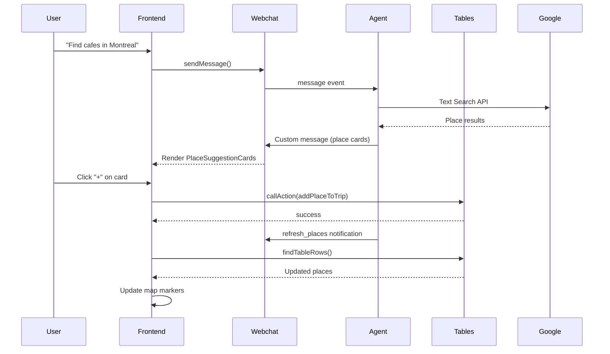

# Travel Copilot

A conversational travel planning application built with **Botpress ADK** and **React**. This example demonstrates how to build a full-stack AI application with real-time state synchronization between an AI agent and a custom frontend.


## Features

- **Natural Language Trip Planning** - Create and manage trips through conversation
- **Google Places Integration** - Search for restaurants, hotels, attractions with real data
- **Interactive Map** - Leaflet-based map with custom markers and preview pins
- **Real-time State Sync** - Frontend stays in sync with agent state via custom events
- **Google Places UI Kit** - Rich place cards with photos, ratings, and details

## Architecture

```mermaid
graph TB
    subgraph Frontend["React Frontend"]
        UI[App Layout]
        Chat[Chat Sidebar<br/>@botpress/webchat]
        Map[Map Canvas<br/>Leaflet]
        Trips[Trip Panel<br/>TripList + TripDetail]
        Store[Zustand Store<br/>travelStore]

        UI --> Chat
        UI --> Map
        UI --> Trips
        Chat --> Store
        Map --> Store
        Trips --> Store
    end

    subgraph Agent["Botpress ADK Agent"]
        Conv[Conversation Handler]
        Tools[AI Tools<br/>trips.ts, places.ts]
        Tables[(Tables<br/>tripsTable, placesTable)]
        Utils[Utilities<br/>stateSync, googlePlaces]

        Conv --> Tools
        Tools --> Tables
        Tools --> Utils
    end

    subgraph External["External Services"]
        Google[Google Places API]
        BP[Botpress Cloud]
    end

    Chat <-->|Webchat Client| BP
    BP <-->|Messages + Events| Conv
    Utils -->|Custom Events| Chat
    Utils -->|Text Search API| Google
    Store -->|@botpress/client| Tables
```

## Data Flow



## Project Structure

```
travel-copilot/
├── agent/                      # Botpress ADK Agent
│   ├── agent.config.ts         # Agent configuration & state schemas
│   ├── src/
│   │   ├── conversations/      # Message handlers
│   │   │   └── index.ts        # Main chat handler with AI tools
│   │   ├── tools/              # AI-callable tools
│   │   │   ├── trips.ts        # createTrip, selectTrip, updateTrip, deleteTrip
│   │   │   └── places.ts       # addPlace, removePlace, listPlaces, searchPlaces
│   │   ├── actions/            # API-callable actions
│   │   │   ├── index.ts        # ping, getTravelState
│   │   │   └── addPlace.ts     # addPlaceToTrip (called from frontend)
│   │   ├── tables/             # Database tables
│   │   │   ├── trips.ts        # Trip storage
│   │   │   └── places.ts       # Place storage
│   │   └── utils/
│   │       ├── stateSync.ts    # Emit UI notifications
│   │       ├── googlePlaces.ts # Google Places API client
│   │       └── context.ts      # Get current user context
│
├── frontend/                   # React Frontend
│   ├── src/
│   │   ├── App.tsx             # Main layout (Map + Trips + Chat)
│   │   ├── components/
│   │   │   ├── ChatSidebar.tsx      # Webchat integration
│   │   │   ├── CustomRenderer.tsx   # Custom message rendering
│   │   │   ├── MapCanvas.tsx        # Leaflet map with markers
│   │   │   ├── TripList.tsx         # Trip selection panel
│   │   │   ├── TripDetail.tsx       # Selected trip details
│   │   │   └── PlaceSuggestionCard.tsx  # Google Places UI card
│   │   ├── stores/
│   │   │   └── travelStore.ts  # Zustand state management
│   │   ├── hooks/
│   │   │   └── useTripData.ts  # Data fetching & actions
│   │   └── types/
│   │       └── index.ts        # TypeScript interfaces
│
├── PLAN.md                     # Implementation plan
└── README.md                   # This file
```

## Key Concepts

### 1. Agent Tools

The agent uses **Autonomous Tools** that the AI can call during conversation:

```typescript
// agent/src/tools/trips.ts
export const createTripTool = new Autonomous.Tool({
  name: "createTrip",
  description: "Create a new trip",
  input: z.object({
    name: z.string(),
    centerLatitude: z.number(),
    centerLongitude: z.number(),
  }),
  async handler(input) {
    // Check for duplicates (deduplication)
    const existing = await tripsTable.findRows({
      filter: { userId: { $eq: userId }, name: { $eq: input.name } },
    });
    if (existing.rows.length > 0) {
      return { success: true, tripId: existing.rows[0].id }; // Return existing
    }
    // Create new trip...
  },
});
```

### 2. State Synchronization

The agent notifies the frontend via **custom messages**:

```typescript
// agent/src/utils/stateSync.ts
export async function notifyRefreshTrips() {
  await client.createMessage({
    type: "custom",
    payload: {
      url: "custom://travel-notification",
      data: { type: "refresh_trips" },
    },
  });
}
```

The frontend handles these in **CustomRenderer**:

```typescript
// frontend/src/components/CustomRenderer.tsx
if (url === "custom://travel-notification") {
  if (data.type === "refresh_trips") {
    fetchTrips(userId);
  }
}
```

### 3. Place Search & Cards

Search results are sent as custom messages with place data:

```typescript
// agent/src/tools/places.ts
await sendPlaceSuggestions(results, tripId);
```

The frontend renders them using **Google's Extended Component Library**:

```tsx
// frontend/src/components/PlaceSuggestionCard.tsx
<PlaceDataProvider place={place.placeId}>
  <PlaceOverview size="medium" googleLogoAlreadyDisplayed />
</PlaceDataProvider>
```

### 4. Frontend Actions

The frontend calls agent actions directly for immediate operations:

```typescript
// frontend/src/hooks/useTripData.ts
const addPlaceToTrip = async (input) => {
  const result = await bpClient.callAction({
    type: "addPlaceToTrip",
    input,
  });
  return result.output;
};
```

## Getting Started

### Prerequisites

- Node.js 18+ or Bun
- Google Maps API key (with Places API enabled)
- Botpress Cloud account

### Setup

1. **Clone and install**
   ```bash
   git clone <repo-url>
   cd travel-copilot

   # Agent
   cd agent
   bun install

   # Frontend
   cd ../frontend
   bun install
   ```

2. **Configure environment**

   Agent (`agent/.env`):
   ```env
   GOOGLE_PLACES_API_KEY=your_google_api_key
   ```

   Frontend (`frontend/.env`):
   ```env
   VITE_WEBCHAT_CLIENT_ID=your_webchat_client_id
   VITE_BOT_ID=your_bot_id
   VITE_BOTPRESS_TOKEN=your_pat_token
   VITE_GOOGLE_MAPS_API_KEY=your_google_api_key
   ```

3. **Run development servers**
   ```bash
   # Terminal 1: Agent
   cd agent
   adk dev

   # Terminal 2: Frontend
   cd frontend
   bun run dev
   ```

4. **Open the app**
   - Frontend: http://localhost:5173
   - Agent console: http://localhost:3001

## Usage Examples

### Create a Trip
> "Create a trip to Montreal"

The agent creates a trip with appropriate coordinates and the map centers on Montreal.

### Search for Places
> "Find coffee shops in downtown Montreal"

Place cards appear with photos, ratings, and action buttons.

### Add Places to Trip
Click the **+** button on any place card, or say:
> "Add Cafe Olimpico to my trip"

### View on Map
Click the **📍** button to see a preview marker on the map.

### Remove Places
> "Remove Cafe Olimpico from my trip"

## System Prompt

The agent uses a streamlined system prompt:

```
You are Travel Copilot, a friendly travel planning assistant.

## Context
- Selected trip: "Montreal Trip" (ID: 5)
- User's trips: Montreal Trip (ID: 5), NYC Trip (ID: 3)
- Places in trip: Cafe Olimpico, Schwartz's Deli

## Key behaviors
1. Creating trips: Use createTrip with coordinates
2. Searching places: Results appear as cards - don't list in text
3. Adding places: Use data from conversation - DON'T search again
4. Deleting trips: Confirm with user first

## IMPORTANT
- Use markdown formatting, NOT HTML
- DON'T list search results - they show as cards
- CRITICAL: Use place data from conversation when adding
```

## Troubleshooting

### Places not showing photos
- Ensure you're using `size="medium"` or larger for PlaceOverview
- Verify Google Maps API key has Places API enabled

### Duplicate trips/places created
- The tools have deduplication: trips by name, places by coordinates
- Check traces at http://localhost:3001 for debugging

### Delete not working
- Use `deleteRowIds([id])` not `deleteRows({ filter })`

## License

MIT
